Channel information
===================
    

Channel information at: T = 26.0 degC, E_rev = 0 mV, [Ca2+] = 0.00043 mM

<table>
    <tr>
<td width="120px">
            <b>Channelpedia_ABasic_13</b> 
            <a href="../Channelpedia_ABasic_13.channel.nml">Channelpedia_ABasic_13.channel.nml</a> 
            <b>Ion: UA</b> 
            <i>g = gmax * m3 * h </i> 
            This is an automated conversion to NeuroML 2 of an ion channel model from Channelpedia. 
The original channel model file can be found at: http://channelpedia.epfl.ch/ionchannels/211

Conversion scripts at https://github.com/OpenSourceBrain/BlueBrainProjectShowcase
</td>
<td>
<a href="Channelpedia_ABasic_13.inf.png">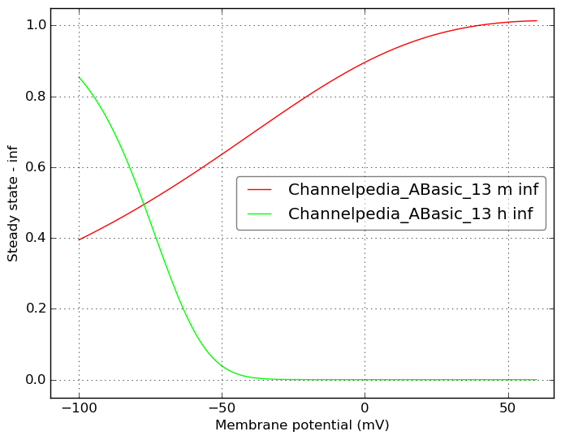</a>
</td>
<td>
<a href="Channelpedia_ABasic_13.tau.png">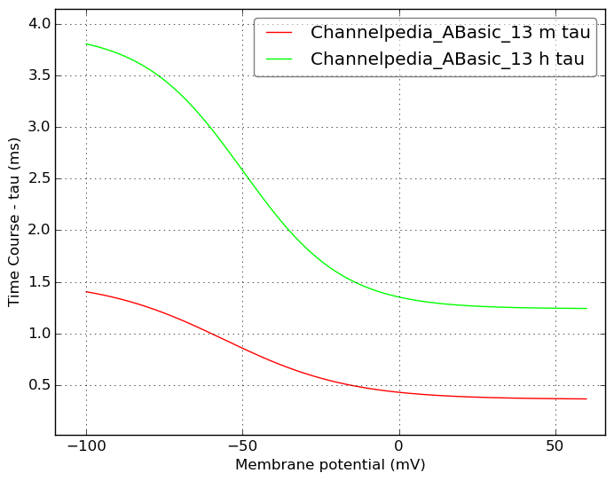</a>
</td>
</tr>
    <tr>
<td width="120px">
            <b>Channelpedia_Ca_LVA_3</b> 
            <a href="../Channelpedia_Ca_LVA_3.channel.nml">Channelpedia_Ca_LVA_3.channel.nml</a> 
            <b>Ion: Ca</b> 
            <i>g = gmax * m2 * h </i> 
            This is an automated conversion to NeuroML 2 of an ion channel model from Channelpedia. 
The original channel model file can be found at: http://channelpedia.epfl.ch/ionchannels/212

Conversion scripts at https://github.com/OpenSourceBrain/BlueBrainProjectShowcase
</td>
<td>
<a href="Channelpedia_Ca_LVA_3.inf.png">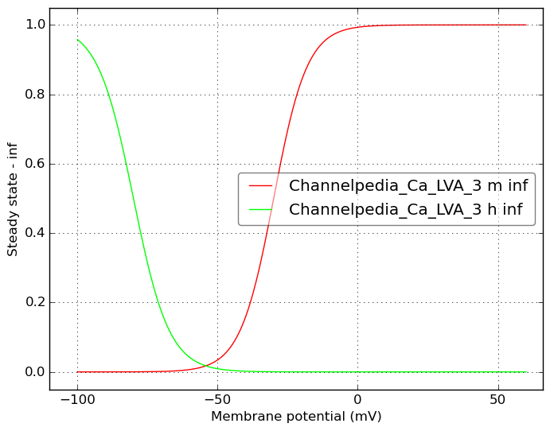</a>
</td>
<td>
<a href="Channelpedia_Ca_LVA_3.tau.png">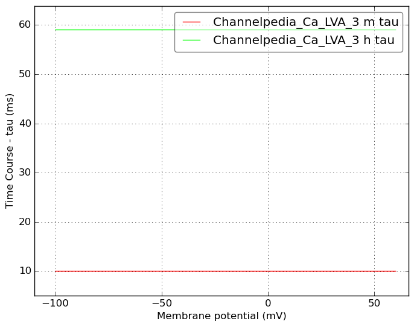</a>
</td>
</tr>
    <tr>
<td width="120px">
            <b>Channelpedia_Ca_LVAs_4</b> 
            <a href="../Channelpedia_Ca_LVAs_4.channel.nml">Channelpedia_Ca_LVAs_4.channel.nml</a> 
            <b>Ion: Ca</b> 
            <i>g = gmax * m2 * h </i> 
            This is an automated conversion to NeuroML 2 of an ion channel model from Channelpedia. 
The original channel model file can be found at: http://channelpedia.epfl.ch/ionchannels/212

Conversion scripts at https://github.com/OpenSourceBrain/BlueBrainProjectShowcase
</td>
<td>

</td>
<td>
<a href="Channelpedia_Ca_LVAs_4.tau.png">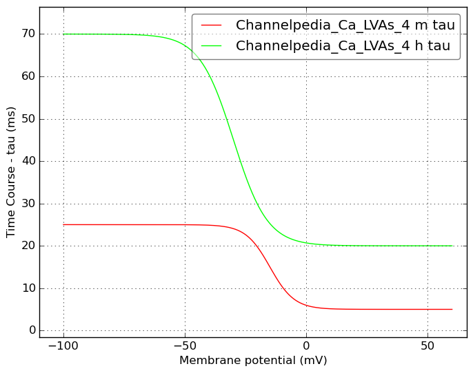</a>
</td>
</tr>
    <tr>
<td width="120px">
            <b>Channelpedia_Ca_P_Q_5</b> 
            <a href="../Channelpedia_Ca_P_Q_5.channel.nml">Channelpedia_Ca_P_Q_5.channel.nml</a> 
            <b>Ion: Ca</b> 
            <i>g = gmax * m </i> 
            This is an automated conversion to NeuroML 2 of an ion channel model from Channelpedia. 
The original channel model file can be found at: http://channelpedia.epfl.ch/ionchannels/78

Conversion scripts at https://github.com/OpenSourceBrain/BlueBrainProjectShowcase
</td>
<td>

</td>
<td>
<a href="Channelpedia_Ca_P_Q_5.tau.png">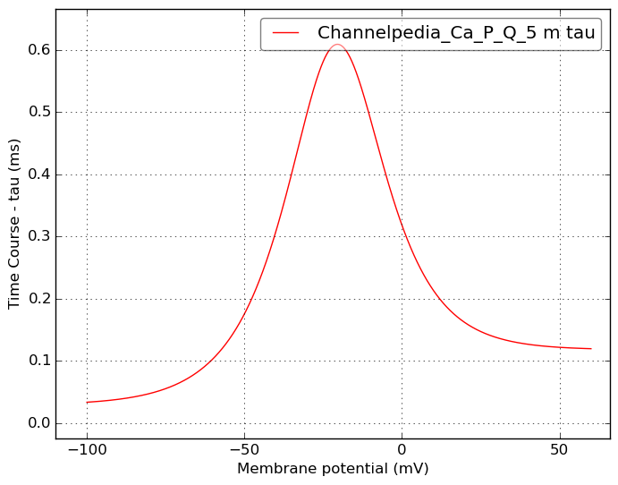</a>
</td>
</tr>
    <tr>
<td width="120px">
            <b>Channelpedia_Ca_R_7</b> 
            <a href="../Channelpedia_Ca_R_7.channel.nml">Channelpedia_Ca_R_7.channel.nml</a> 
            <b>Ion: Ca</b> 
            <i>g = gmax * m * h </i> 
            This is an automated conversion to NeuroML 2 of an ion channel model from Channelpedia. 
The original channel model file can be found at: http://channelpedia.epfl.ch/ionchannels/82

Conversion scripts at https://github.com/OpenSourceBrain/BlueBrainProjectShowcase
</td>
<td>
<a href="Channelpedia_Ca_R_7.inf.png">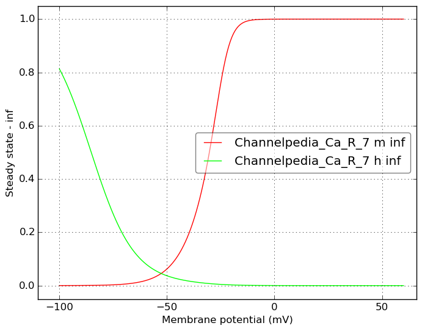</a>
</td>
<td>
<a href="Channelpedia_Ca_R_7.tau.png">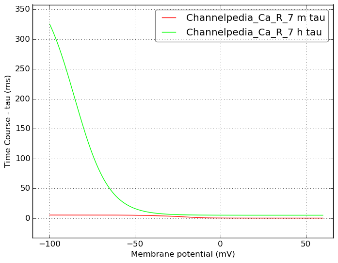</a>
</td>
</tr>
    <tr>
<td width="120px">
            <b>Channelpedia_Cav3_3_42</b> 
            <a href="../Channelpedia_Cav3_3_42.channel.nml">Channelpedia_Cav3_3_42.channel.nml</a> 
            <b>Ion: Ca</b> 
            <i>g = gmax * m * h </i> 
            This is an automated conversion to NeuroML 2 of an ion channel model from Channelpedia. 
The original channel model file can be found at: http://channelpedia.epfl.ch/ionchannels/87

Conversion scripts at https://github.com/OpenSourceBrain/BlueBrainProjectShowcase
</td>
<td>
<a href="Channelpedia_Cav3_3_42.inf.png">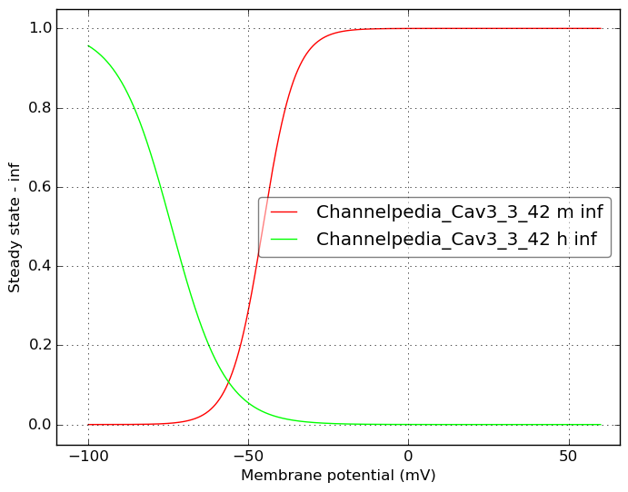</a>
</td>
<td>
<a href="Channelpedia_Cav3_3_42.tau.png">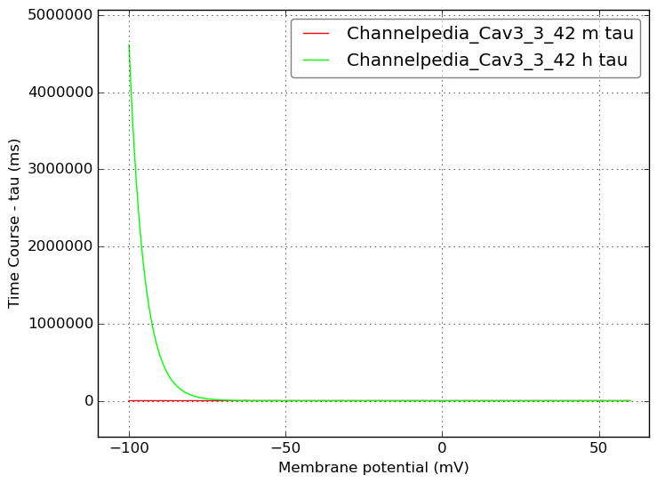</a>
</td>
</tr>
    <tr>
<td width="120px">
            <b>Channelpedia_Generic_Ca_8</b> 
            <a href="../Channelpedia_Generic_Ca_8.channel.nml">Channelpedia_Generic_Ca_8.channel.nml</a> 
            <b>Ion: Ca</b> 
            <i>g = gmax * m2 * h </i> 
            This is an automated conversion to NeuroML 2 of an ion channel model from Channelpedia. 
The original channel model file can be found at: http://channelpedia.epfl.ch/ionchannels/190

Conversion scripts at https://github.com/OpenSourceBrain/BlueBrainProjectShowcase
</td>
<td>
<a href="Channelpedia_Generic_Ca_8.inf.png">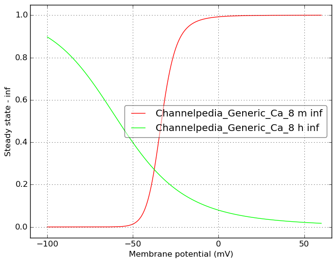</a>
</td>
<td>
<a href="Channelpedia_Generic_Ca_8.tau.png">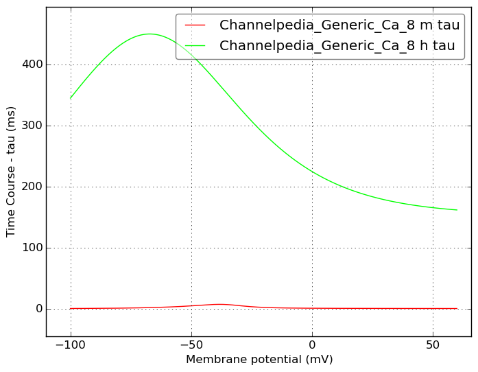</a>
</td>
</tr>
    <tr>
<td width="120px">
            <b>Channelpedia_HCN1_9</b> 
            <a href="../Channelpedia_HCN1_9.channel.nml">Channelpedia_HCN1_9.channel.nml</a> 
            <b>Ion: Hcn</b> 
            <i>g = gmax * m </i> 
            This is an automated conversion to NeuroML 2 of an ion channel model from Channelpedia. 
The original channel model file can be found at: http://channelpedia.epfl.ch/ionchannels/61

Conversion scripts at https://github.com/OpenSourceBrain/BlueBrainProjectShowcase
</td>
<td>
<a href="Channelpedia_HCN1_9.inf.png">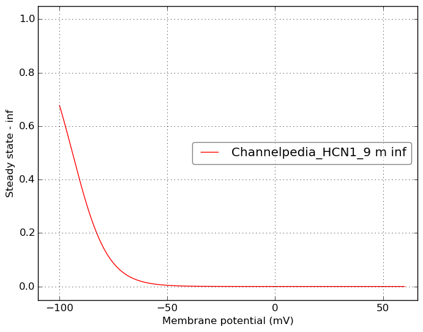</a>
</td>
<td>
<a href="Channelpedia_HCN1_9.tau.png">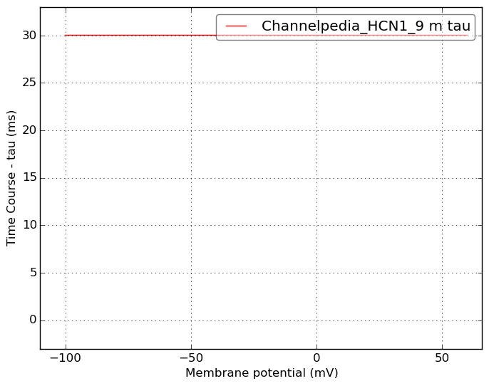</a>
</td>
</tr>
    <tr>
<td width="120px">
            <b>Channelpedia_HCN2_10</b> 
            <a href="../Channelpedia_HCN2_10.channel.nml">Channelpedia_HCN2_10.channel.nml</a> 
            <b>Ion: Hcn</b> 
            <i>g = gmax * m </i> 
            This is an automated conversion to NeuroML 2 of an ion channel model from Channelpedia. 
The original channel model file can be found at: http://channelpedia.epfl.ch/ionchannels/62

Conversion scripts at https://github.com/OpenSourceBrain/BlueBrainProjectShowcase
</td>
<td>

</td>
<td>
<a href="Channelpedia_HCN2_10.tau.png">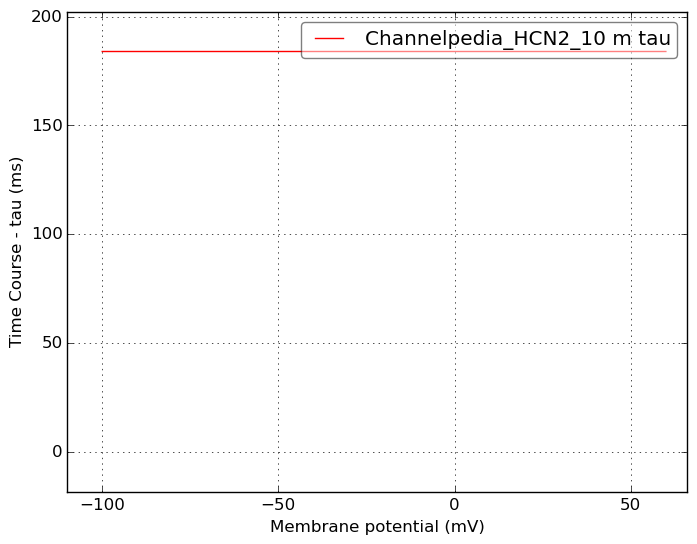</a>
</td>
</tr>
    <tr>
<td width="120px">
            <b>Channelpedia_HCN3_11</b> 
            <a href="../Channelpedia_HCN3_11.channel.nml">Channelpedia_HCN3_11.channel.nml</a> 
            <b>Ion: Hcn</b> 
            <i>g = gmax * m </i> 
            This is an automated conversion to NeuroML 2 of an ion channel model from Channelpedia. 
The original channel model file can be found at: http://channelpedia.epfl.ch/ionchannels/63

Conversion scripts at https://github.com/OpenSourceBrain/BlueBrainProjectShowcase
</td>
<td>
<a href="Channelpedia_HCN3_11.inf.png">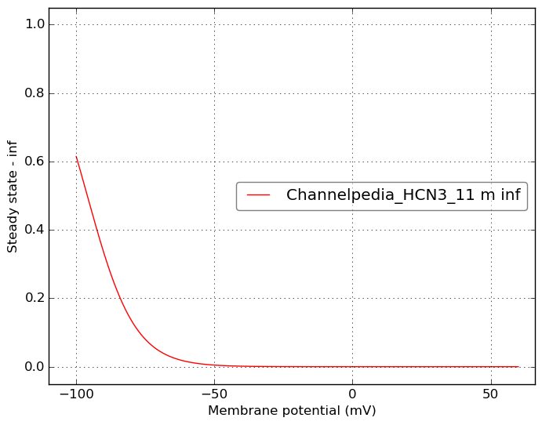</a>
</td>
<td>
<a href="Channelpedia_HCN3_11.tau.png">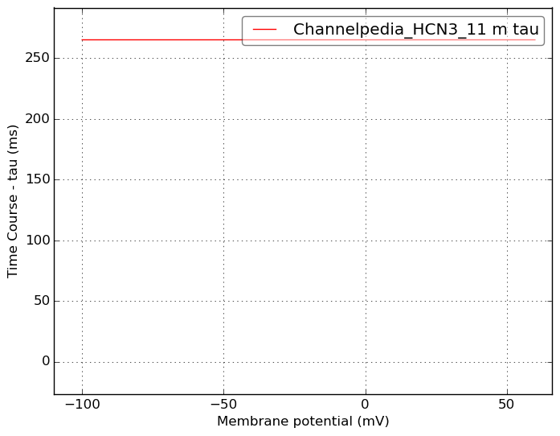</a>
</td>
</tr>
    <tr>
<td width="120px">
            <b>Channelpedia_HCN4_12</b> 
            <a href="../Channelpedia_HCN4_12.channel.nml">Channelpedia_HCN4_12.channel.nml</a> 
            <b>Ion: Hcn</b> 
            <i>g = gmax * m </i> 
            This is an automated conversion to NeuroML 2 of an ion channel model from Channelpedia. 
The original channel model file can be found at: http://channelpedia.epfl.ch/ionchannels/64

Conversion scripts at https://github.com/OpenSourceBrain/BlueBrainProjectShowcase
</td>
<td>
<a href="Channelpedia_HCN4_12.inf.png">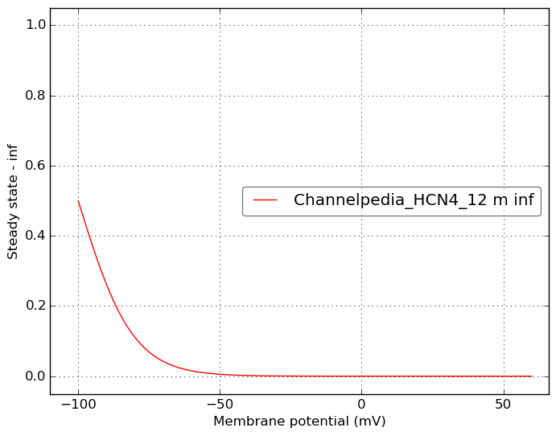</a>
</td>
<td>
<a href="Channelpedia_HCN4_12.tau.png">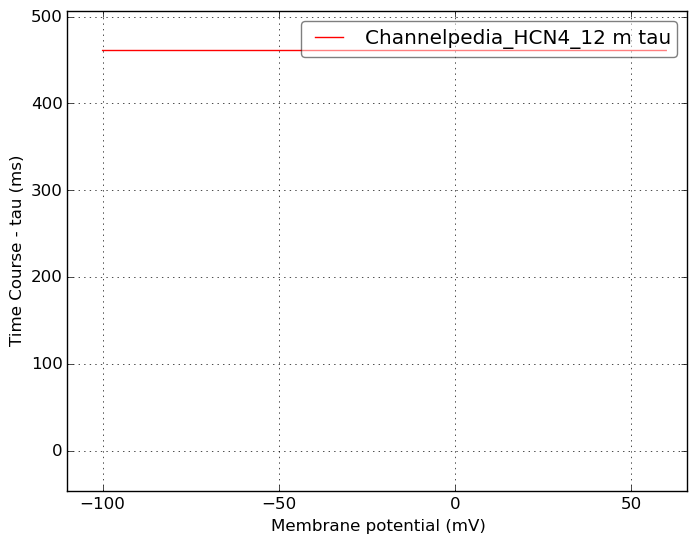</a>
</td>
</tr>
    <tr>
<td width="120px">
            <b>Channelpedia_HHK_1</b> 
            <a href="../Channelpedia_HHK_1.channel.nml">Channelpedia_HHK_1.channel.nml</a> 
            <b>Ion: K</b> 
            <i>g = gmax * m4 </i> 
            This is an automated conversion to NeuroML 2 of an ion channel model from Channelpedia. 
The original channel model file can be found at: http://channelpedia.epfl.ch/ionchannels/188

Conversion scripts at https://github.com/OpenSourceBrain/BlueBrainProjectShowcase
</td>
<td>

</td>
<td>
<a href="Channelpedia_HHK_1.tau.png">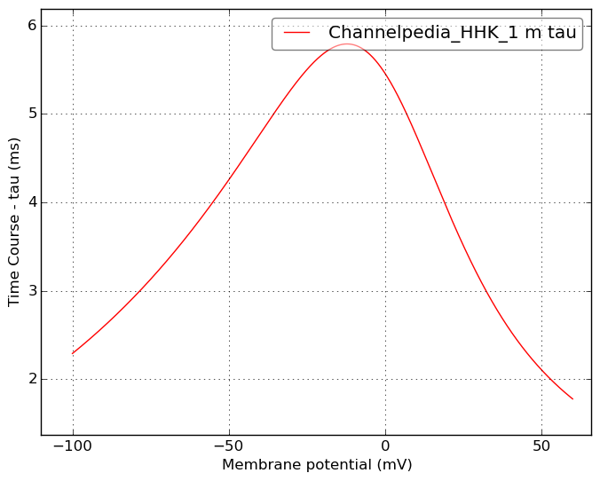</a>
</td>
</tr>
    <tr>
<td width="120px">
            <b>Channelpedia_Ih_14</b> 
            <a href="../Channelpedia_Ih_14.channel.nml">Channelpedia_Ih_14.channel.nml</a> 
            <b>Ion: Hcn</b> 
            <i>g = gmax * m </i> 
            This is an automated conversion to NeuroML 2 of an ion channel model from Channelpedia. 
The original channel model file can be found at: http://channelpedia.epfl.ch/ionchannels/206

Conversion scripts at https://github.com/OpenSourceBrain/BlueBrainProjectShowcase
</td>
<td>
<a href="Channelpedia_Ih_14.inf.png">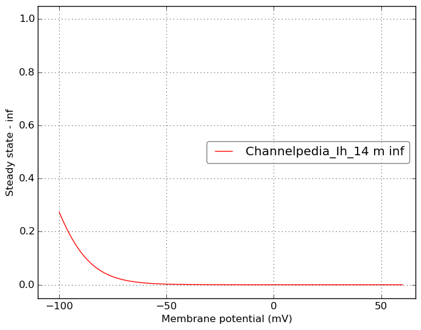</a>
</td>
<td>
<a href="Channelpedia_Ih_14.tau.png">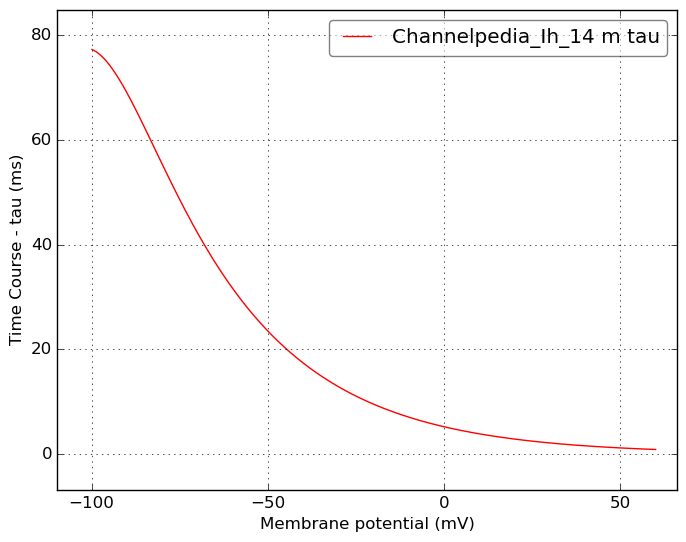</a>
</td>
</tr>
    <tr>
<td width="120px">
            <b>Channelpedia_Kfast_32</b> 
            <a href="../Channelpedia_Kfast_32.channel.nml">Channelpedia_Kfast_32.channel.nml</a> 
            <b>Ion: K</b> 
            <i>g = gmax * m * h </i> 
            This is an automated conversion to NeuroML 2 of an ion channel model from Channelpedia. 
The original channel model file can be found at: http://channelpedia.epfl.ch/ionchannels/188

Conversion scripts at https://github.com/OpenSourceBrain/BlueBrainProjectShowcase
</td>
<td>
<a href="Channelpedia_Kfast_32.inf.png">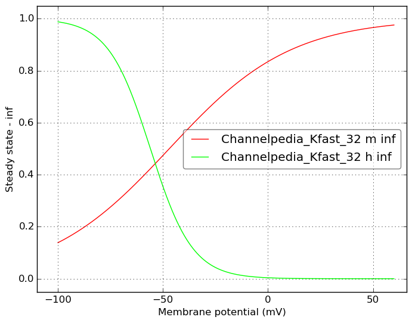</a>
</td>
<td>
<a href="Channelpedia_Kfast_32.tau.png">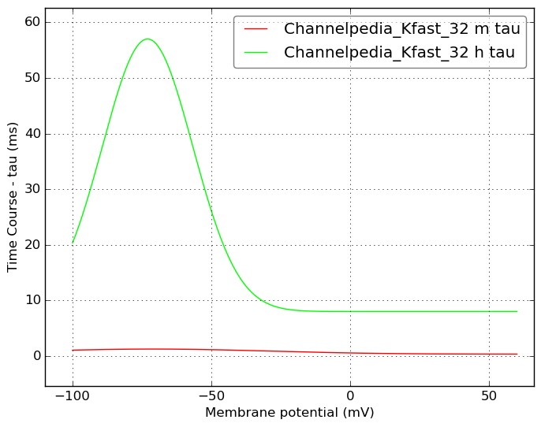</a>
</td>
</tr>
    <tr>
<td width="120px">
            <b>Channelpedia_Kir21_44</b> 
            <a href="../Channelpedia_Kir21_44.channel.nml">Channelpedia_Kir21_44.channel.nml</a> 
            <b>Ion: K</b> 
            <i>g = gmax * m * h2 </i> 
            This is an automated conversion to NeuroML 2 of an ion channel model from Channelpedia. 
The original channel model file can be found at: http://channelpedia.epfl.ch/ionchannels/42

Conversion scripts at https://github.com/OpenSourceBrain/BlueBrainProjectShowcase
</td>
<td>
<a href="Channelpedia_Kir21_44.inf.png">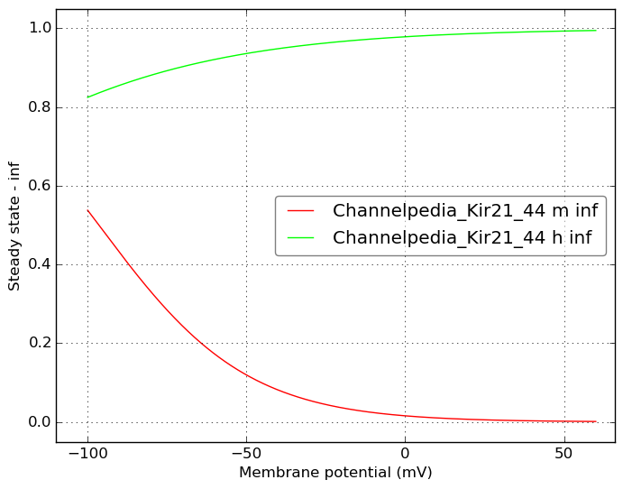</a>
</td>
<td>
<a href="Channelpedia_Kir21_44.tau.png">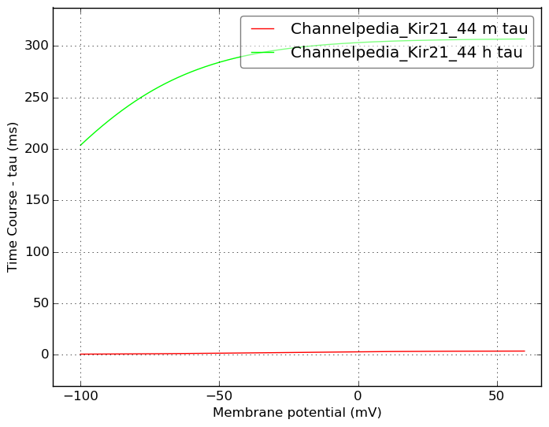</a>
</td>
</tr>
    <tr>
<td width="120px">
            <b>Channelpedia_Km1_15</b> 
            <a href="../Channelpedia_Km1_15.channel.nml">Channelpedia_Km1_15.channel.nml</a> 
            <b>Ion: K</b> 
            <i>g = gmax * m </i> 
            This is an automated conversion to NeuroML 2 of an ion channel model from Channelpedia. 
The original channel model file can be found at: http://channelpedia.epfl.ch/ionchannels/213

Conversion scripts at https://github.com/OpenSourceBrain/BlueBrainProjectShowcase
</td>
<td>
<a href="Channelpedia_Km1_15.inf.png">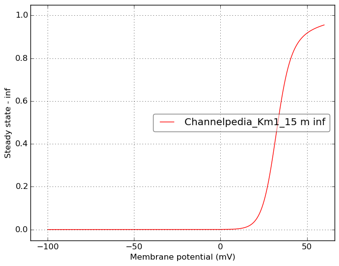</a>
</td>
<td>
<a href="Channelpedia_Km1_15.tau.png">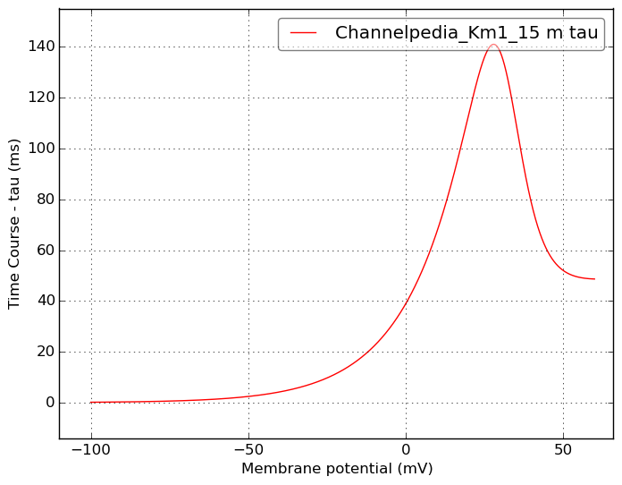</a>
</td>
</tr>
    <tr>
<td width="120px">
            <b>Channelpedia_Km2_16</b> 
            <a href="../Channelpedia_Km2_16.channel.nml">Channelpedia_Km2_16.channel.nml</a> 
            <b>Ion: K</b> 
            <i>g = gmax * m </i> 
            This is an automated conversion to NeuroML 2 of an ion channel model from Channelpedia. 
The original channel model file can be found at: http://channelpedia.epfl.ch/ionchannels/213

Conversion scripts at https://github.com/OpenSourceBrain/BlueBrainProjectShowcase
</td>
<td>
<a href="Channelpedia_Km2_16.inf.png">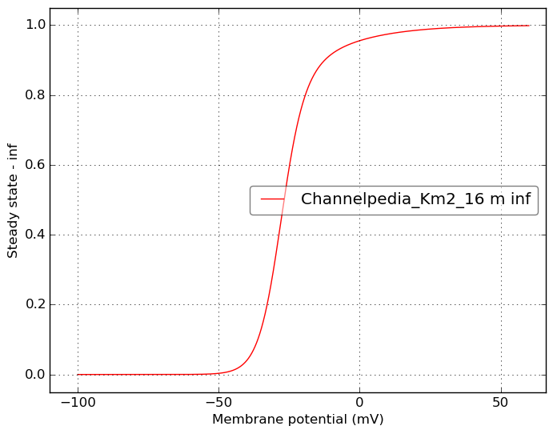</a>
</td>
<td>
<a href="Channelpedia_Km2_16.tau.png">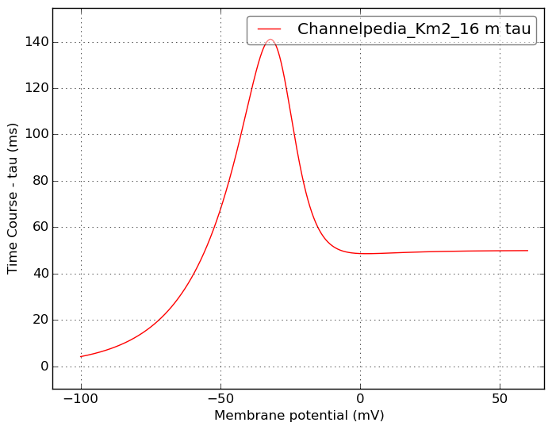</a>
</td>
</tr>
    <tr>
<td width="120px">
            <b>Channelpedia_KSlow_30</b> 
            <a href="../Channelpedia_KSlow_30.channel.nml">Channelpedia_KSlow_30.channel.nml</a> 
            <b>Ion: K</b> 
            <i>g = gmax * m2 * h </i> 
            This is an automated conversion to NeuroML 2 of an ion channel model from Channelpedia. 
The original channel model file can be found at: http://channelpedia.epfl.ch/ionchannels/188

Conversion scripts at https://github.com/OpenSourceBrain/BlueBrainProjectShowcase
</td>
<td>
<a href="Channelpedia_KSlow_30.inf.png">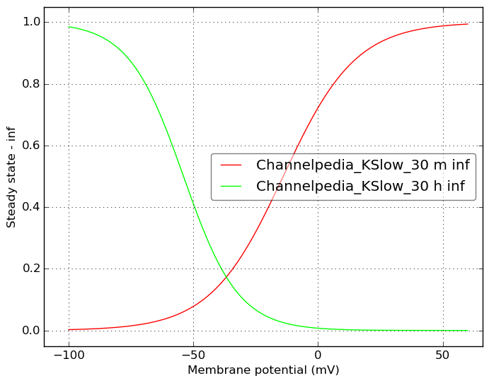</a>
</td>
<td>
<a href="Channelpedia_KSlow_30.tau.png">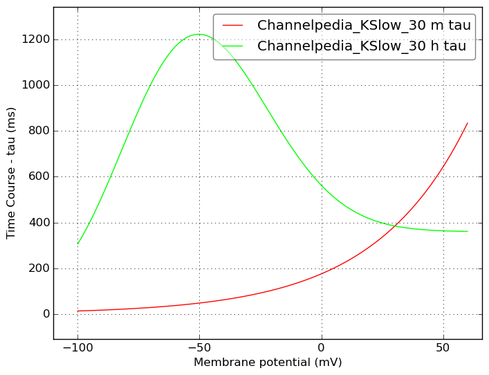</a>
</td>
</tr>
    <tr>
<td width="120px">
            <b>Channelpedia_KSlow_S_31</b> 
            <a href="../Channelpedia_KSlow_S_31.channel.nml">Channelpedia_KSlow_S_31.channel.nml</a> 
            <b>Ion: K</b> 
            <i>g = gmax * m2 * h </i> 
            This is an automated conversion to NeuroML 2 of an ion channel model from Channelpedia. 
The original channel model file can be found at: http://channelpedia.epfl.ch/ionchannels/188

Conversion scripts at https://github.com/OpenSourceBrain/BlueBrainProjectShowcase
</td>
<td>
<a href="Channelpedia_KSlow_S_31.inf.png">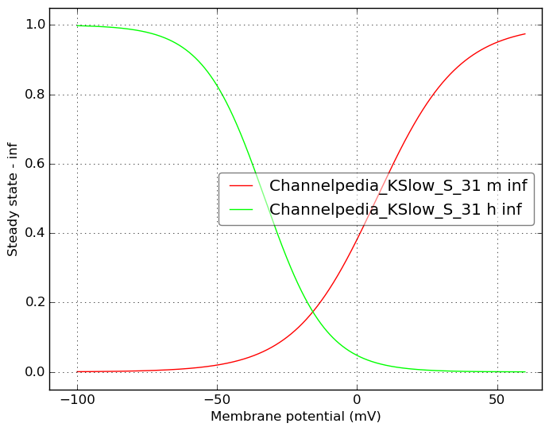</a>
</td>
<td>
<a href="Channelpedia_KSlow_S_31.tau.png">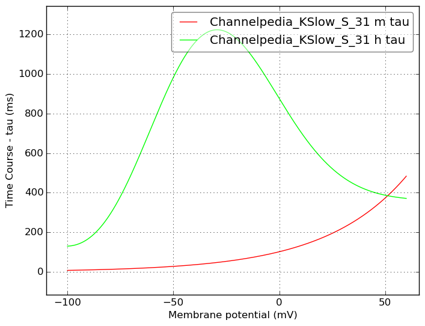</a>
</td>
</tr>
    <tr>
<td width="120px">
            <b>Channelpedia_Kv1_1_18</b> 
            <a href="../Channelpedia_Kv1_1_18.channel.nml">Channelpedia_Kv1_1_18.channel.nml</a> 
            <b>Ion: K</b> 
            <i>g = gmax * m * h2 </i> 
            This is an automated conversion to NeuroML 2 of an ion channel model from Channelpedia. 
The original channel model file can be found at: http://channelpedia.epfl.ch/ionchannels/1

Conversion scripts at https://github.com/OpenSourceBrain/BlueBrainProjectShowcase
</td>
<td>
<a href="Channelpedia_Kv1_1_18.inf.png">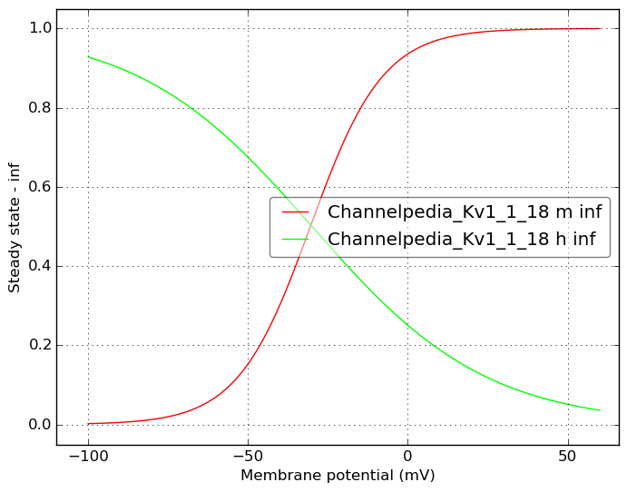</a>
</td>
<td>
<a href="Channelpedia_Kv1_1_18.tau.png">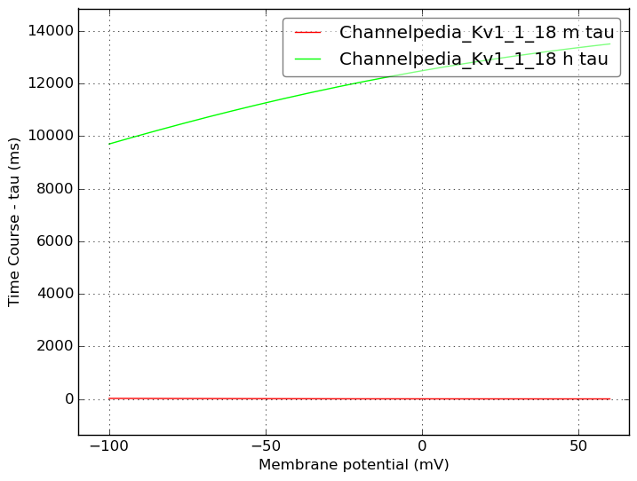</a>
</td>
</tr>
    <tr>
<td width="120px">
            <b>Channelpedia_Kv1_2_19</b> 
            <a href="../Channelpedia_Kv1_2_19.channel.nml">Channelpedia_Kv1_2_19.channel.nml</a> 
            <b>Ion: K</b> 
            <i>g = gmax * m * h </i> 
            This is an automated conversion to NeuroML 2 of an ion channel model from Channelpedia. 
The original channel model file can be found at: http://channelpedia.epfl.ch/ionchannels/2

Conversion scripts at https://github.com/OpenSourceBrain/BlueBrainProjectShowcase
</td>
<td>

</td>
<td>

</td>
</tr>
    <tr>
<td width="120px">
            <b>Channelpedia_Kv1_3_38</b> 
            <a href="../Channelpedia_Kv1_3_38.channel.nml">Channelpedia_Kv1_3_38.channel.nml</a> 
            <b>Ion: K</b> 
            <i>g = gmax * m * h </i> 
            This is an automated conversion to NeuroML 2 of an ion channel model from Channelpedia. 
The original channel model file can be found at: http://channelpedia.epfl.ch/ionchannels/3

Conversion scripts at https://github.com/OpenSourceBrain/BlueBrainProjectShowcase
</td>
<td>
<a href="Channelpedia_Kv1_3_38.inf.png">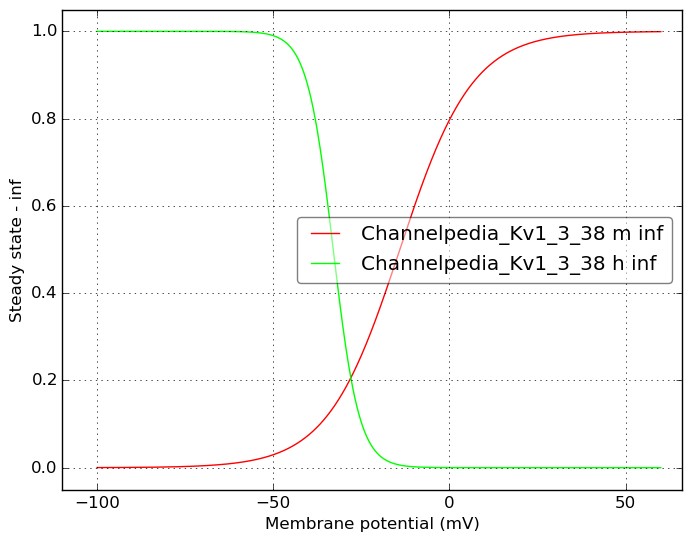</a>
</td>
<td>
<a href="Channelpedia_Kv1_3_38.tau.png">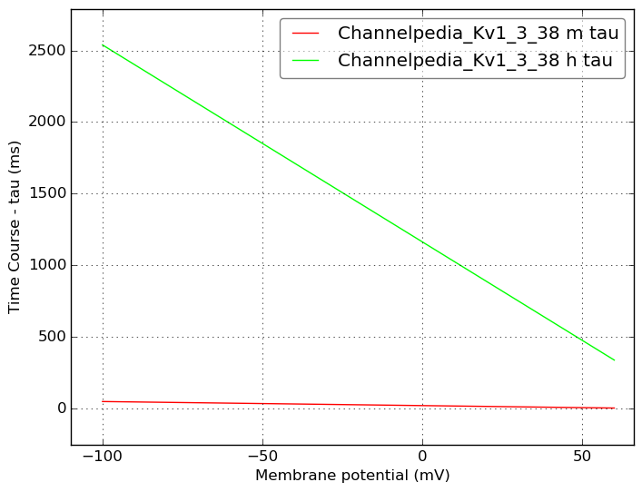</a>
</td>
</tr>
    <tr>
<td width="120px">
            <b>Channelpedia_Kv1_4_20</b> 
            <a href="../Channelpedia_Kv1_4_20.channel.nml">Channelpedia_Kv1_4_20.channel.nml</a> 
            <b>Ion: K</b> 
            <i>g = gmax * m * h </i> 
            This is an automated conversion to NeuroML 2 of an ion channel model from Channelpedia. 
The original channel model file can be found at: http://channelpedia.epfl.ch/ionchannels/4

Conversion scripts at https://github.com/OpenSourceBrain/BlueBrainProjectShowcase
</td>
<td>
<a href="Channelpedia_Kv1_4_20.inf.png">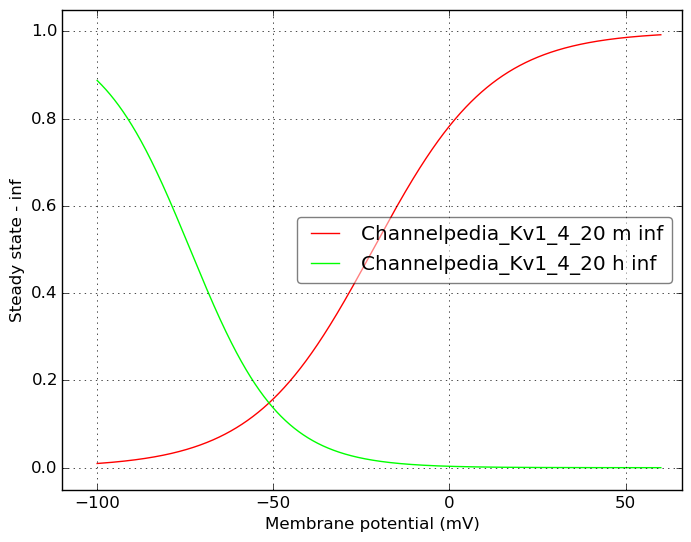</a>
</td>
<td>
<a href="Channelpedia_Kv1_4_20.tau.png">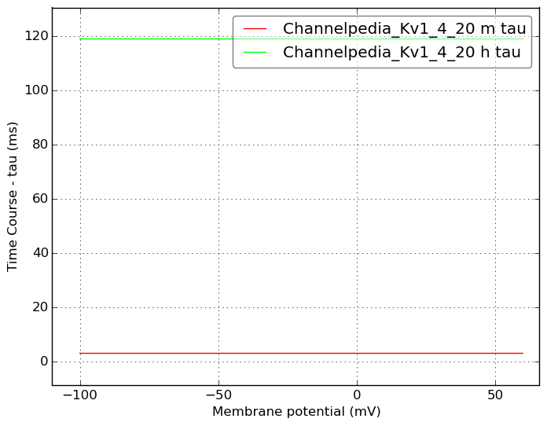</a>
</td>
</tr>
    <tr>
<td width="120px">
            <b>Channelpedia_Kv1_5_21</b> 
            <a href="../Channelpedia_Kv1_5_21.channel.nml">Channelpedia_Kv1_5_21.channel.nml</a> 
            <b>Ion: K</b> 
            <i>g = gmax * m * h </i> 
            This is an automated conversion to NeuroML 2 of an ion channel model from Channelpedia. 
The original channel model file can be found at: http://channelpedia.epfl.ch/ionchannels/5

Conversion scripts at https://github.com/OpenSourceBrain/BlueBrainProjectShowcase
</td>
<td>
<a href="Channelpedia_Kv1_5_21.inf.png">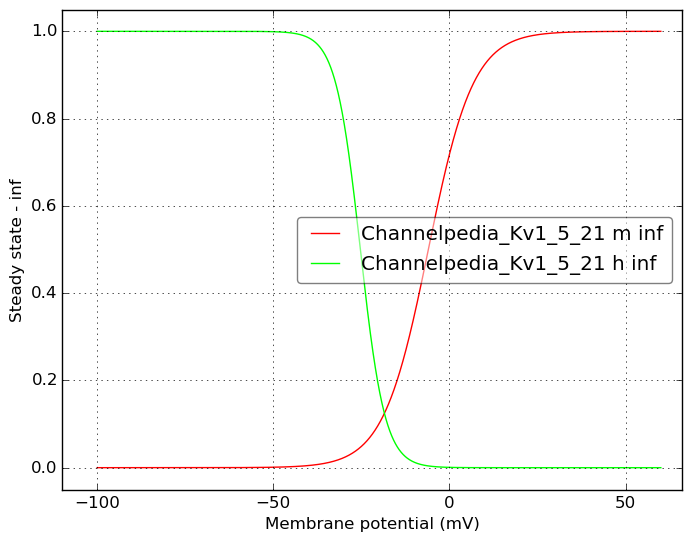</a>
</td>
<td>
<a href="Channelpedia_Kv1_5_21.tau.png">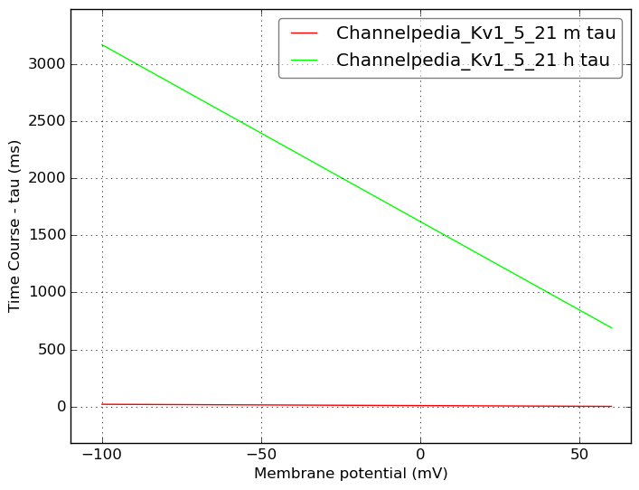</a>
</td>
</tr>
    <tr>
<td width="120px">
            <b>Channelpedia_Kv1_6_22</b> 
            <a href="../Channelpedia_Kv1_6_22.channel.nml">Channelpedia_Kv1_6_22.channel.nml</a> 
            <b>Ion: K</b> 
            <i>g = gmax * m * h </i> 
            This is an automated conversion to NeuroML 2 of an ion channel model from Channelpedia. 
The original channel model file can be found at: http://channelpedia.epfl.ch/ionchannels/6

Conversion scripts at https://github.com/OpenSourceBrain/BlueBrainProjectShowcase
</td>
<td>
<a href="Channelpedia_Kv1_6_22.inf.png">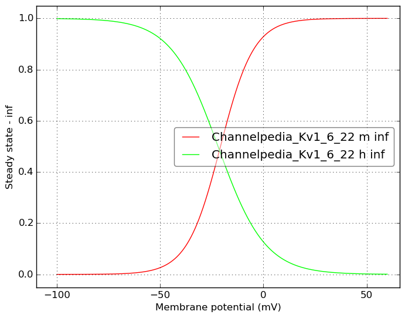</a>
</td>
<td>
<a href="Channelpedia_Kv1_6_22.tau.png">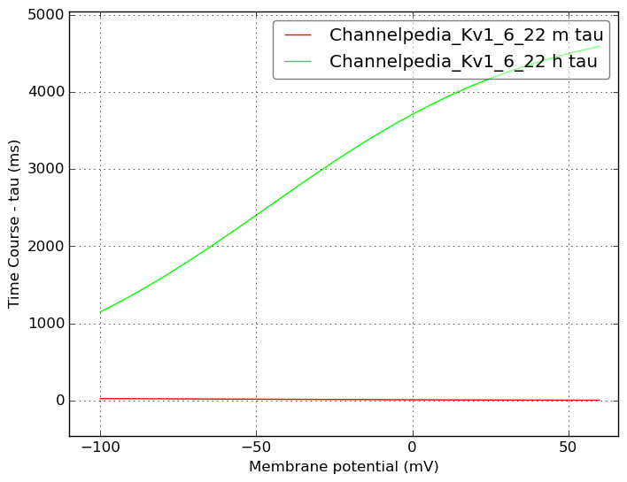</a>
</td>
</tr>
    <tr>
<td width="120px">
            <b>Channelpedia_Kv2_1_23</b> 
            <a href="../Channelpedia_Kv2_1_23.channel.nml">Channelpedia_Kv2_1_23.channel.nml</a> 
            <b>Ion: K</b> 
            <i>g = gmax * m * h </i> 
            This is an automated conversion to NeuroML 2 of an ion channel model from Channelpedia. 
The original channel model file can be found at: http://channelpedia.epfl.ch/ionchannels/9

Conversion scripts at https://github.com/OpenSourceBrain/BlueBrainProjectShowcase
</td>
<td>
<a href="Channelpedia_Kv2_1_23.inf.png">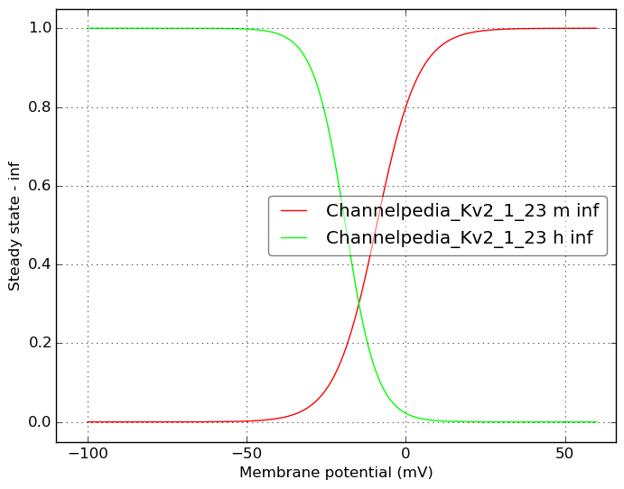</a>
</td>
<td>
<a href="Channelpedia_Kv2_1_23.tau.png">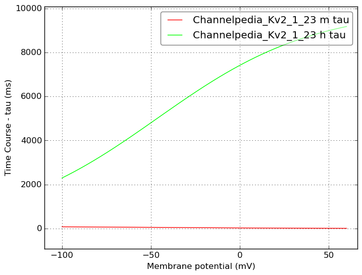</a>
</td>
</tr>
    <tr>
<td width="120px">
            <b>Channelpedia_Kv2_2_24</b> 
            <a href="../Channelpedia_Kv2_2_24.channel.nml">Channelpedia_Kv2_2_24.channel.nml</a> 
            <b>Ion: K</b> 
            <i>g = gmax * m * h </i> 
            This is an automated conversion to NeuroML 2 of an ion channel model from Channelpedia. 
The original channel model file can be found at: http://channelpedia.epfl.ch/ionchannels/10

Conversion scripts at https://github.com/OpenSourceBrain/BlueBrainProjectShowcase
</td>
<td>
<a href="Channelpedia_Kv2_2_24.inf.png">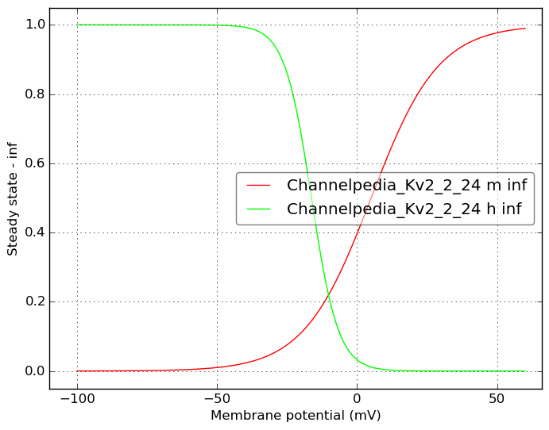</a>
</td>
<td>
<a href="Channelpedia_Kv2_2_24.tau.png">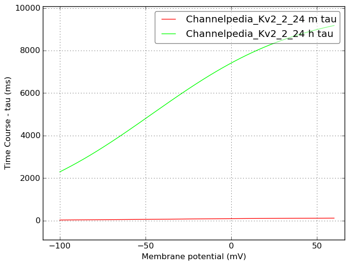</a>
</td>
</tr>
    <tr>
<td width="120px">
            <b>Channelpedia_Kv3_1_25</b> 
            <a href="../Channelpedia_Kv3_1_25.channel.nml">Channelpedia_Kv3_1_25.channel.nml</a> 
            <b>Ion: K</b> 
            <i>g = gmax * m </i> 
            This is an automated conversion to NeuroML 2 of an ion channel model from Channelpedia. 
The original channel model file can be found at: http://channelpedia.epfl.ch/ionchannels/11

Conversion scripts at https://github.com/OpenSourceBrain/BlueBrainProjectShowcase
</td>
<td>
<a href="Channelpedia_Kv3_1_25.inf.png">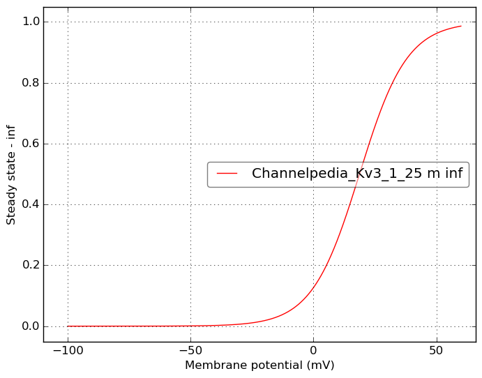</a>
</td>
<td>

</td>
</tr>
    <tr>
<td width="120px">
            <b>Channelpedia_Kv3_1_S_27</b> 
            <a href="../Channelpedia_Kv3_1_S_27.channel.nml">Channelpedia_Kv3_1_S_27.channel.nml</a> 
            <b>Ion: K</b> 
            <i>g = gmax * m </i> 
            This is an automated conversion to NeuroML 2 of an ion channel model from Channelpedia. 
The original channel model file can be found at: http://channelpedia.epfl.ch/ionchannels/11

Conversion scripts at https://github.com/OpenSourceBrain/BlueBrainProjectShowcase
</td>
<td>
<a href="Channelpedia_Kv3_1_S_27.inf.png">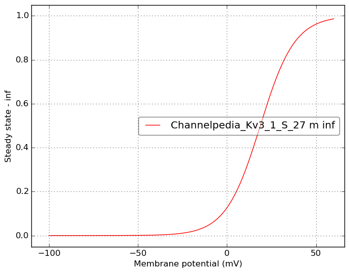</a>
</td>
<td>
<a href="Channelpedia_Kv3_1_S_27.tau.png">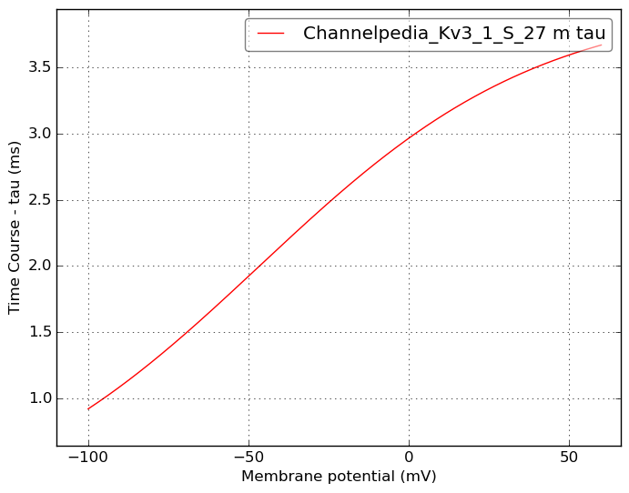</a>
</td>
</tr>
    <tr>
<td width="120px">
            <b>Channelpedia_Kv3_2_39</b> 
            <a href="../Channelpedia_Kv3_2_39.channel.nml">Channelpedia_Kv3_2_39.channel.nml</a> 
            <b>Ion: K</b> 
            <i>g = gmax * m2 </i> 
            This is an automated conversion to NeuroML 2 of an ion channel model from Channelpedia. 
The original channel model file can be found at: http://channelpedia.epfl.ch/ionchannels/12

Conversion scripts at https://github.com/OpenSourceBrain/BlueBrainProjectShowcase
</td>
<td>
<a href="Channelpedia_Kv3_2_39.inf.png">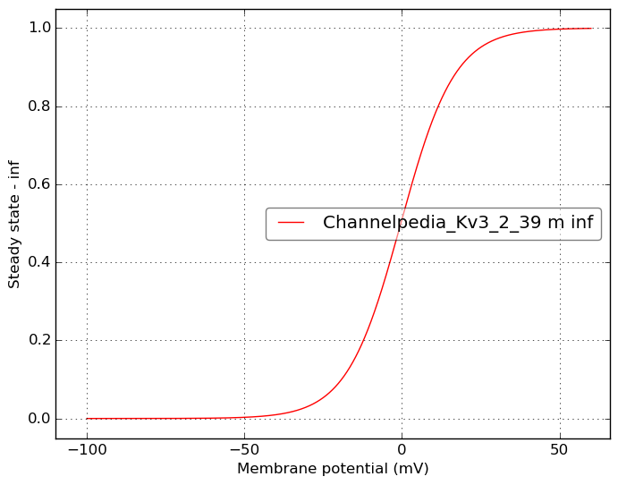</a>
</td>
<td>
<a href="Channelpedia_Kv3_2_39.tau.png">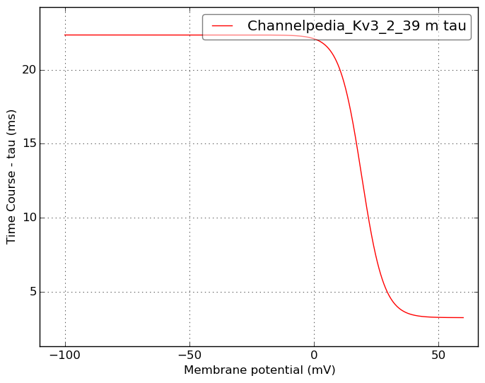</a>
</td>
</tr>
    <tr>
<td width="120px">
            <b>Channelpedia_Kv3_3_28</b> 
            <a href="../Channelpedia_Kv3_3_28.channel.nml">Channelpedia_Kv3_3_28.channel.nml</a> 
            <b>Ion: K</b> 
            <i>g = gmax * m </i> 
            This is an automated conversion to NeuroML 2 of an ion channel model from Channelpedia. 
The original channel model file can be found at: http://channelpedia.epfl.ch/ionchannels/13

Conversion scripts at https://github.com/OpenSourceBrain/BlueBrainProjectShowcase
</td>
<td>

</td>
<td>
<a href="Channelpedia_Kv3_3_28.tau.png">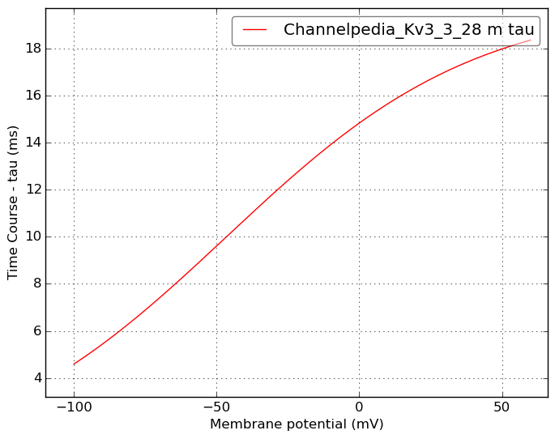</a>
</td>
</tr>
    <tr>
<td width="120px">
            <b>Channelpedia_Kv3_3_45</b> 
            <a href="../Channelpedia_Kv3_3_45.channel.nml">Channelpedia_Kv3_3_45.channel.nml</a> 
            <b>Ion: K</b> 
            <i>g = gmax * m2 * h </i> 
            This is an automated conversion to NeuroML 2 of an ion channel model from Channelpedia. 
The original channel model file can be found at: http://channelpedia.epfl.ch/ionchannels/13

Conversion scripts at https://github.com/OpenSourceBrain/BlueBrainProjectShowcase
</td>
<td>
<a href="Channelpedia_Kv3_3_45.inf.png">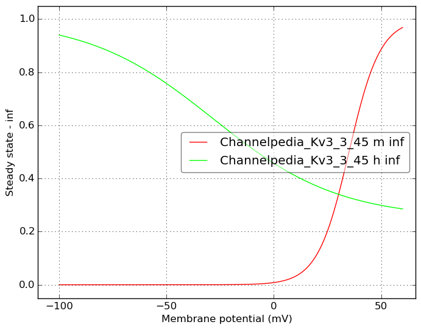</a>
</td>
<td>
<a href="Channelpedia_Kv3_3_45.tau.png">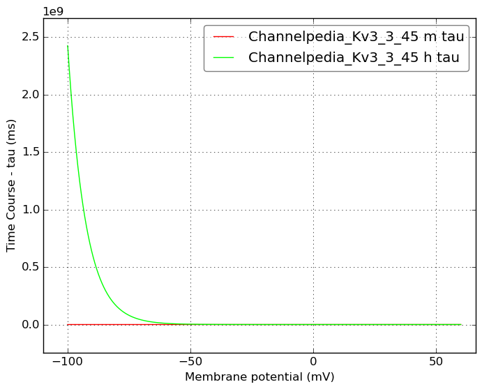</a>
</td>
</tr>
    <tr>
<td width="120px">
            <b>Channelpedia_Kv3_4_29</b> 
            <a href="../Channelpedia_Kv3_4_29.channel.nml">Channelpedia_Kv3_4_29.channel.nml</a> 
            <b>Ion: K</b> 
            <i>g = gmax * m * h </i> 
            This is an automated conversion to NeuroML 2 of an ion channel model from Channelpedia. 
The original channel model file can be found at: http://channelpedia.epfl.ch/ionchannels/14

Conversion scripts at https://github.com/OpenSourceBrain/BlueBrainProjectShowcase
</td>
<td>
<a href="Channelpedia_Kv3_4_29.inf.png">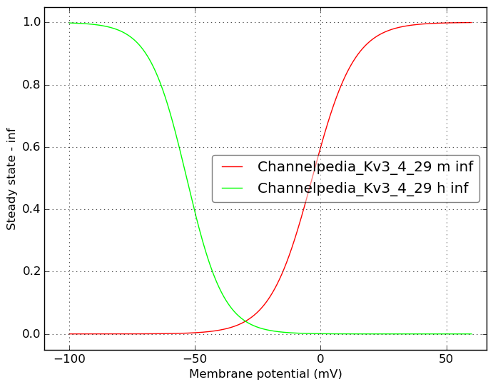</a>
</td>
<td>
<a href="Channelpedia_Kv3_4_29.tau.png">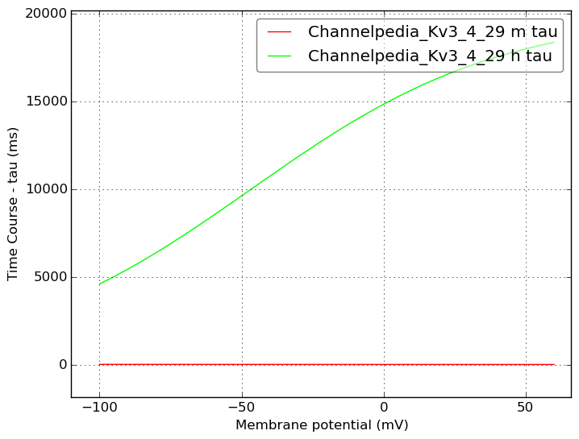</a>
</td>
</tr>
    <tr>
<td width="120px">
            <b>Channelpedia_McCormick_Na_34</b> 
            <a href="../Channelpedia_McCormick_Na_34.channel.nml">Channelpedia_McCormick_Na_34.channel.nml</a> 
            <b>Ion: Na</b> 
            <i>g = gmax * m3 * h </i> 
            This is an automated conversion to NeuroML 2 of an ion channel model from Channelpedia. 
The original channel model file can be found at: http://channelpedia.epfl.ch/ionchannels/189

Conversion scripts at https://github.com/OpenSourceBrain/BlueBrainProjectShowcase
</td>
<td>
<a href="Channelpedia_McCormick_Na_34.inf.png">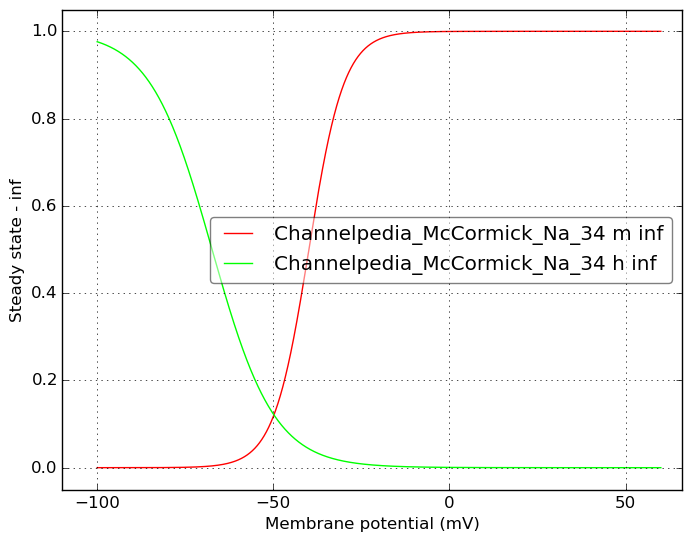</a>
</td>
<td>
<a href="Channelpedia_McCormick_Na_34.tau.png">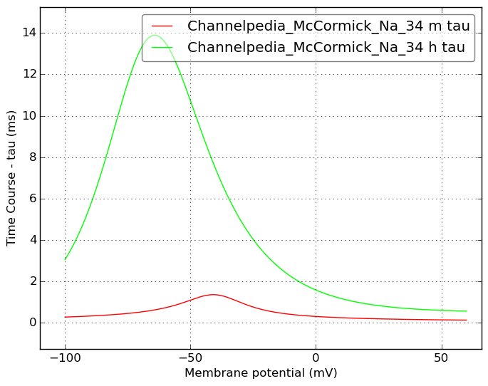</a>
</td>
</tr>
    <tr>
<td width="120px">
            <b>Channelpedia_Na_35</b> 
            <a href="../Channelpedia_Na_35.channel.nml">Channelpedia_Na_35.channel.nml</a> 
            <b>Ion: Na</b> 
            <i>g = gmax * m3 * h </i> 
            This is an automated conversion to NeuroML 2 of an ion channel model from Channelpedia. 
The original channel model file can be found at: http://channelpedia.epfl.ch/ionchannels/189

Conversion scripts at https://github.com/OpenSourceBrain/BlueBrainProjectShowcase
</td>
<td>
<a href="Channelpedia_Na_35.inf.png">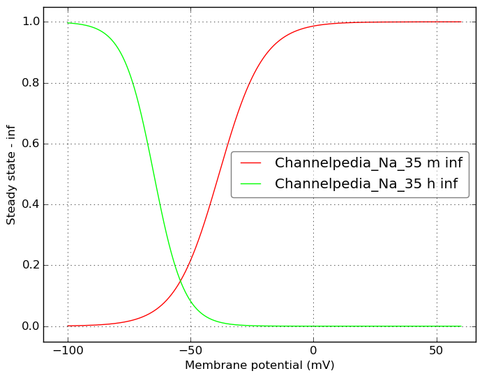</a>
</td>
<td>
<a href="Channelpedia_Na_35.tau.png">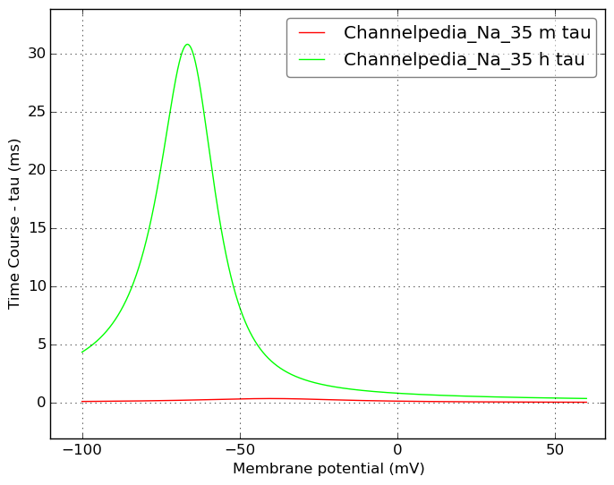</a>
</td>
</tr>
    <tr>
<td width="120px">
            <b>Channelpedia_NaP_37</b> 
            <a href="../Channelpedia_NaP_37.channel.nml">Channelpedia_NaP_37.channel.nml</a> 
            <b>Ion: Na</b> 
            <i>g = gmax * m3 </i> 
            This is an automated conversion to NeuroML 2 of an ion channel model from Channelpedia. 
The original channel model file can be found at: http://channelpedia.epfl.ch/ionchannels/189

Conversion scripts at https://github.com/OpenSourceBrain/BlueBrainProjectShowcase
</td>
<td>
<a href="Channelpedia_NaP_37.inf.png">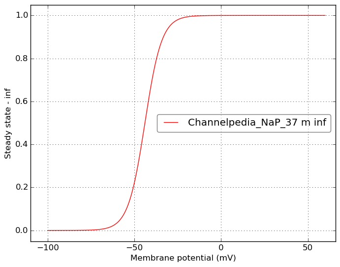</a>
</td>
<td>

</td>
</tr>
    <tr>
<td width="120px">
            <b>Channelpedia_Nav1_3_43</b> 
            <a href="../Channelpedia_Nav1_3_43.channel.nml">Channelpedia_Nav1_3_43.channel.nml</a> 
            <b>Ion: Na</b> 
            <i>g = gmax * m3 * h </i> 
            This is an automated conversion to NeuroML 2 of an ion channel model from Channelpedia. 
The original channel model file can be found at: http://channelpedia.epfl.ch/ionchannels/122

Conversion scripts at https://github.com/OpenSourceBrain/BlueBrainProjectShowcase
</td>
<td>
<a href="Channelpedia_Nav1_3_43.inf.png">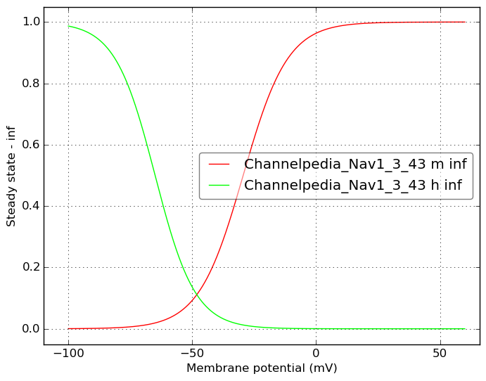</a>
</td>
<td>
<a href="Channelpedia_Nav1_3_43.tau.png">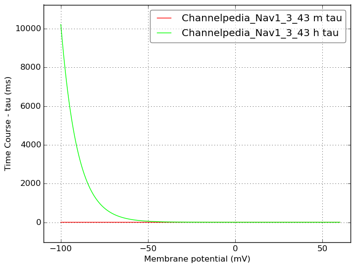</a>
</td>
</tr>
    <tr>
<td width="120px">
            <b>Channelpedia_Nav1_6_33</b> 
            <a href="../Channelpedia_Nav1_6_33.channel.nml">Channelpedia_Nav1_6_33.channel.nml</a> 
            <b>Ion: Na</b> 
            <i>g = gmax * m </i> 
            This is an automated conversion to NeuroML 2 of an ion channel model from Channelpedia. 
The original channel model file can be found at: http://channelpedia.epfl.ch/ionchannels/125

Conversion scripts at https://github.com/OpenSourceBrain/BlueBrainProjectShowcase
</td>
<td>
<a href="Channelpedia_Nav1_6_33.inf.png">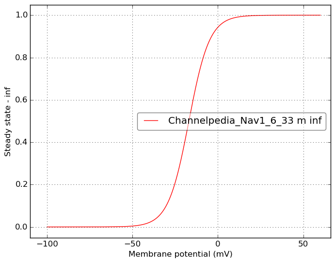</a>
</td>
<td>
<a href="Channelpedia_Nav1_6_33.tau.png">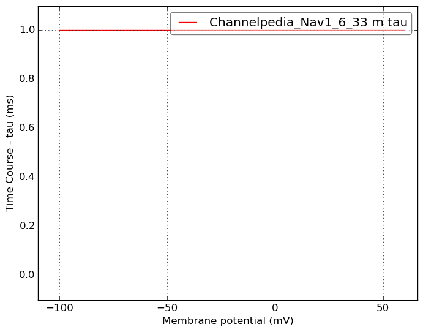</a>
</td>
</tr>
</table>

