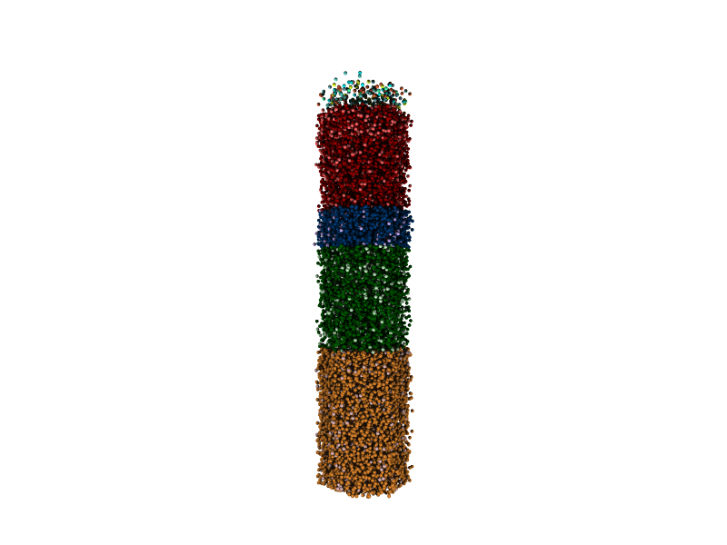

## Conversion of the BBP connectome to NeuroML 2 format

This is based on the released point neuron version of the connectome at: https://bbp.epfl.ch/nmc-portal/downloads#

The file used was cons_locs_pathways_mc0_Column.h5 from average_full.tar

This has been converted using [BBPConnectomeReader](https://github.com/NeuroML/NetworkShorthand/blob/a78e0e846ba89a18bfc5fed96dc61eea6e9ebb15/proposal/networkshorthand/BBPConnectomeReader.py) (work in progress).

Image below is generated from BBP_100percent.net.nml.h5 using pynml-povray from [pyNeuroML](https://github.com/NeuroML/pyNeuroML).

