Channel information
===================
    

Channel information at: T = 22.0 degC, E_rev = 0 mV, [Ca2+] = 0.00043 mM

<table>
    <tr>
<td width="120px">
            <b>NaTa_t</b> 
            <a href="../NaTa_t.channel.nml">NaTa_t.channel.nml</a> 
            <b>Ion: na</b> 
            <i>g = gmax * m3 * h </i> 
            Fast inactivating Na+ current
            
Comment from original mod file: 
:Reference :Colbert and Pan 2002
</td>
<td>
<a href="NaTa_t.inf.png">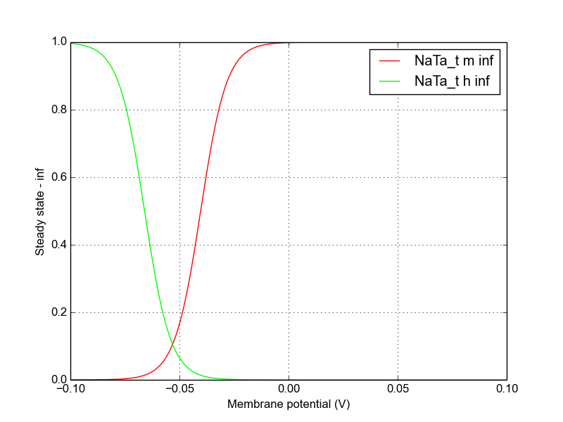</a>
</td>
<td>
<a href="NaTa_t.tau.png">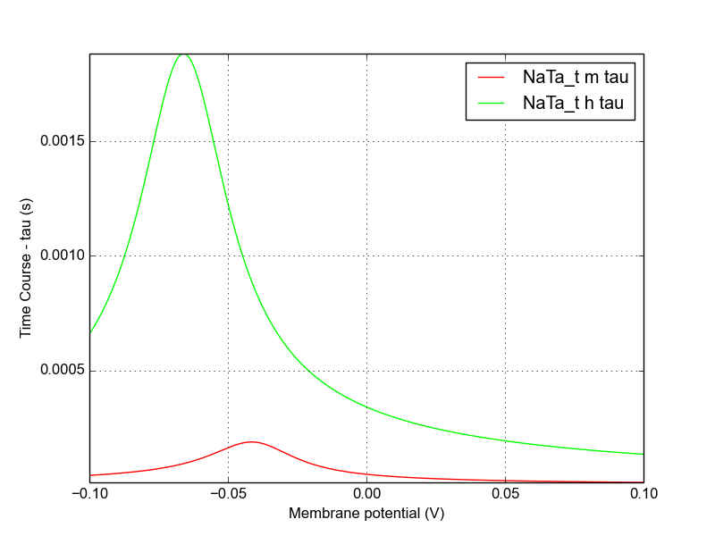</a>
</td>
</tr>
    <tr>
<td width="120px">
            <b>Nap_Et2</b> 
            <a href="../Nap_Et2.channel.nml">Nap_Et2.channel.nml</a> 
            <b>Ion: na</b> 
            <i>g = gmax * m3 * h </i> 
            Persistent Na+ current
            
Comment from original mod file: 
:Comment : mtau deduced from text (said to be 6 times faster than for NaTa)
:Comment : so I used the equations from NaT and multiplied by 6
:Reference : Modeled according to kinetics derived from Magistretti and Alonso 1999
:Comment: corrected rates using q10 = 2.3, target temperature 34, orginal 21
</td>
<td>
<a href="Nap_Et2.inf.png">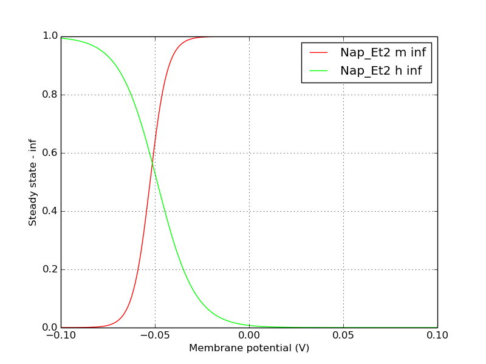</a>
</td>
<td>
<a href="Nap_Et2.tau.png">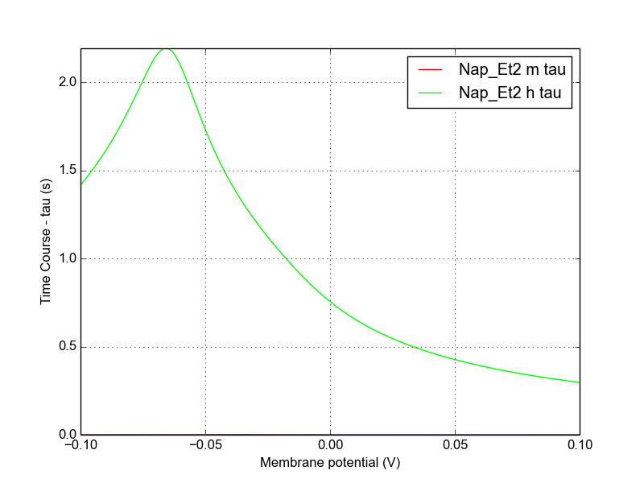</a>
</td>
</tr>
    <tr>
<td width="120px">
            <b>NaTs2_t</b> 
            <a href="../NaTs2_t.channel.nml">NaTs2_t.channel.nml</a> 
            <b>Ion: na</b> 
            <i>g = gmax * m3 * h </i> 
            Fast inactivating Na+ current. Comment from mod file (NaTs2_t.mod): took the NaTa and shifted both activation/inactivation by 6 mv
</td>
<td>
<a href="NaTs2_t.inf.png">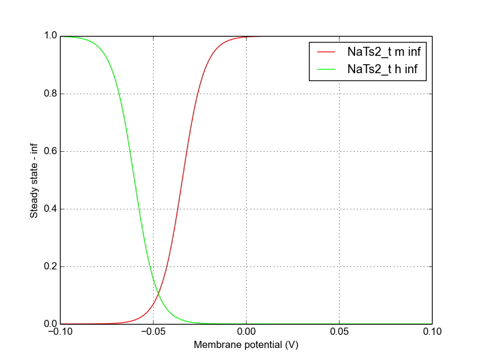</a>
</td>
<td>
<a href="NaTs2_t.tau.png">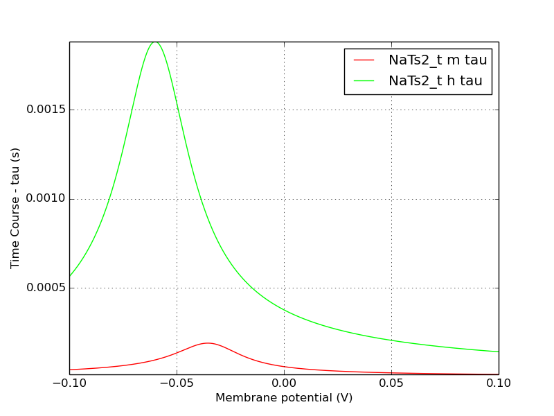</a>
</td>
</tr>
    <tr>
<td width="120px">
            <b>K_Tst</b> 
            <a href="../K_Tst.channel.nml">K_Tst.channel.nml</a> 
            <b>Ion: k</b> 
            <i>g = gmax * m4 * h </i> 
            Fast inactivating K+ current
            
Comment from original mod file: 
:Comment : The transient component of the K current
:Reference : :		Voltage-gated K+ channels in layer 5 neocortical pyramidal neurones from young rats:subtypes and gradients,Korngreen and Sakmann, J. Physiology, 2000
:Comment : shifted -10 mv to correct for junction potential
:Comment: corrected rates using q10 = 2.3, target temperature 34, orginal 21
</td>
<td>
<a href="K_Tst.inf.png">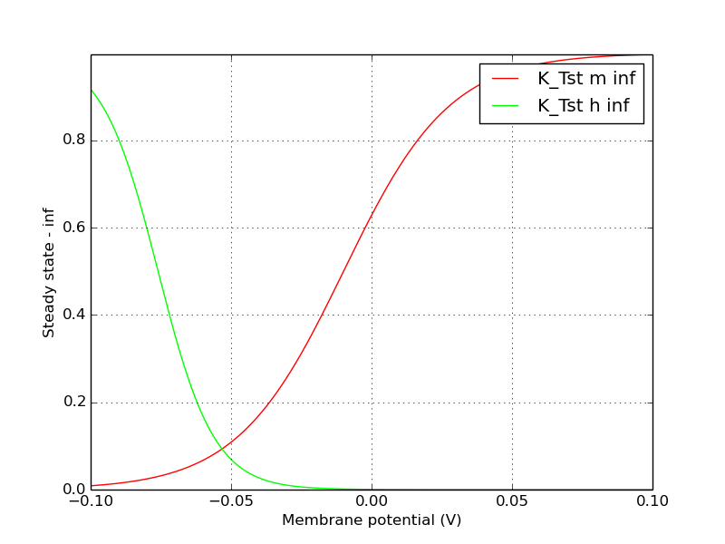</a>
</td>
<td>
<a href="K_Tst.tau.png">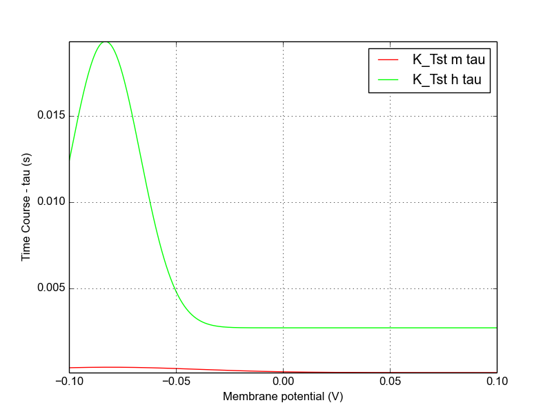</a>
</td>
</tr>
    <tr>
<td width="120px">
            <b>K_Pst</b> 
            <a href="../K_Pst.channel.nml">K_Pst.channel.nml</a> 
            <b>Ion: k</b> 
            <i>g = gmax * m2 * h </i> 
            Slow inactivating K+ current
            
Comment from original mod file: 
:Comment : The persistent component of the K current
:Reference : :		Voltage-gated K+ channels in layer 5 neocortical pyramidal neurones from young rats:subtypes and gradients,Korngreen and Sakmann, J. Physiology, 2000
:Comment : shifted -10 mv to correct for junction potential
:Comment: corrected rates using q10 = 2.3, target temperature 34, orginal 21
</td>
<td>
<a href="K_Pst.inf.png">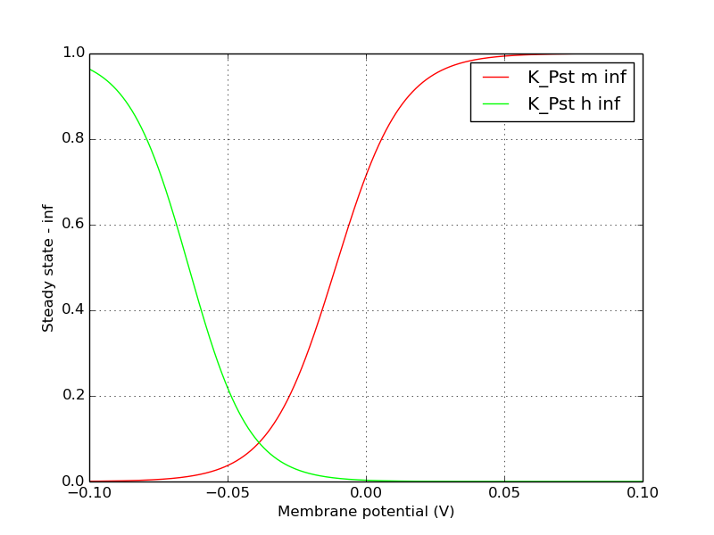</a>
</td>
<td>
<a href="K_Pst.tau.png">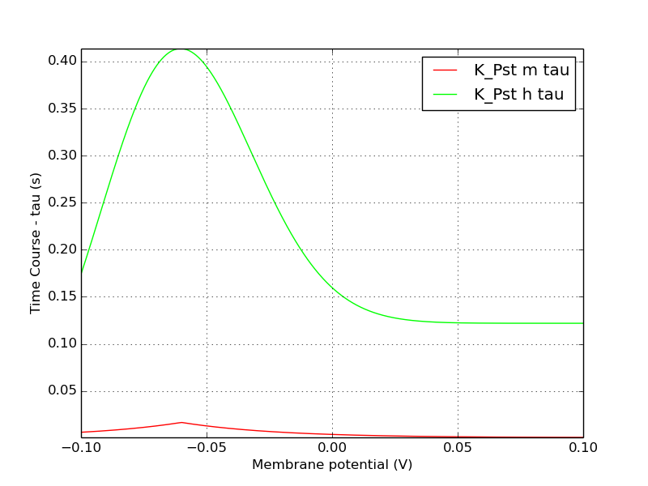</a>
</td>
</tr>
    <tr>
<td width="120px">
            <b>SKv3_1</b> 
            <a href="../SKv3_1.channel.nml">SKv3_1.channel.nml</a> 
            <b>Ion: k</b> 
            <i>g = gmax * m </i> 
            Fast, non inactivating K+ current
            
Comment from original mod file: 
:Reference : :		Characterization of a Shaw-related potassium channel family in rat brain, The EMBO Journal, vol.11, no.7,2473-2486 (1992)
</td>
<td>
<a href="SKv3_1.inf.png">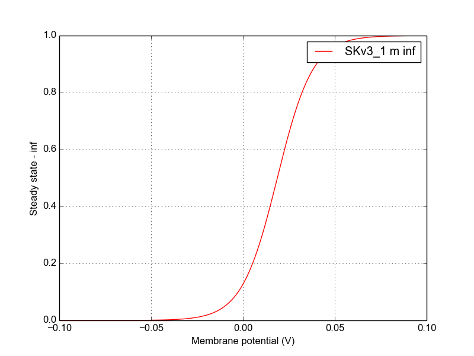</a>
</td>
<td>
<a href="SKv3_1.tau.png">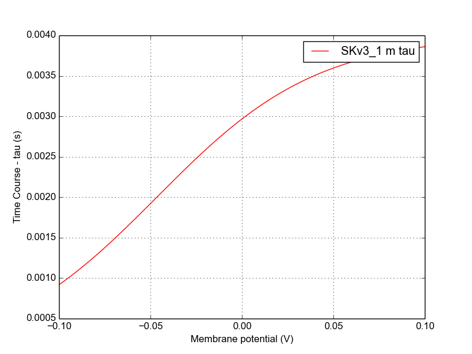</a>
</td>
</tr>
    <tr>
<td width="120px">
            <b>SK_E2</b> 
            <a href="../SK_E2.channel.nml">SK_E2.channel.nml</a> 
            <b>Ion: k</b> 
            <i>g = gmax * z </i> 
            Small-conductance, Ca2+ activated K+ current
            
Comment from original mod file: 
: SK-type calcium-activated potassium current
: Reference : Kohler et al. 1996
</td>
<td>
<a href="SK_E2.inf.png">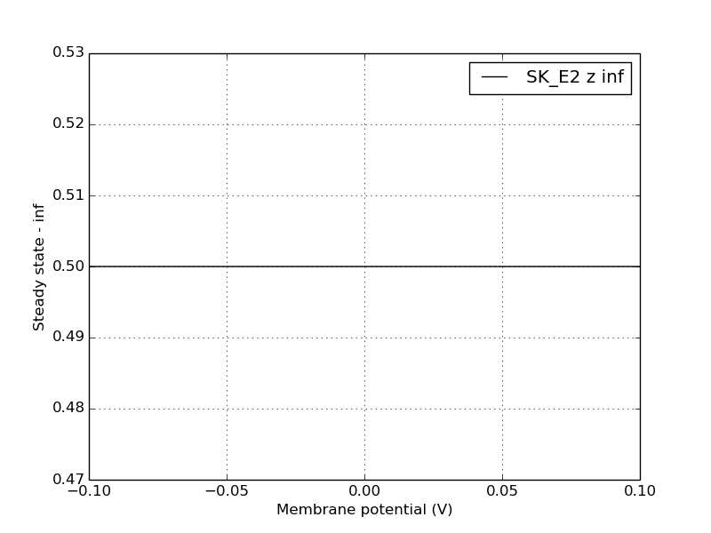</a>
</td>
<td>
<a href="SK_E2.tau.png">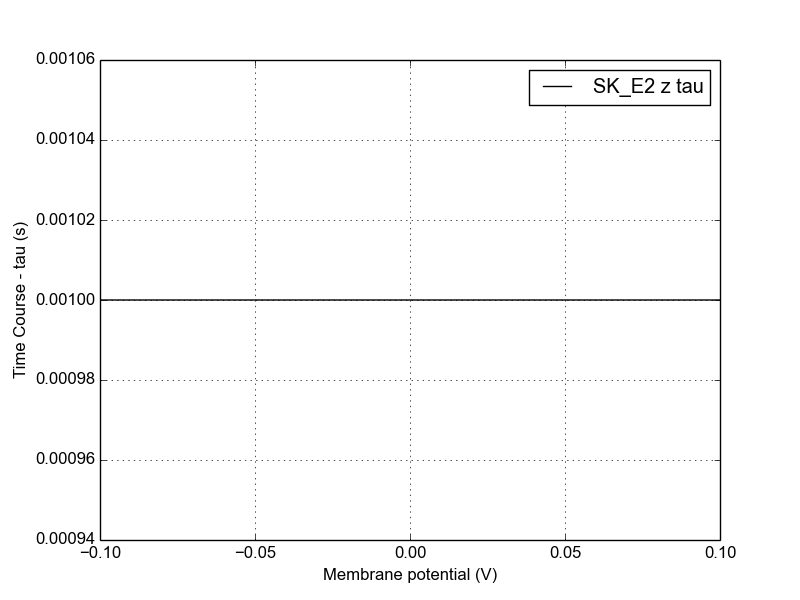</a>
</td>
</tr>
    <tr>
<td width="120px">
            <b>Ca_LVAst</b> 
            <a href="../Ca_LVAst.channel.nml">Ca_LVAst.channel.nml</a> 
            <b>Ion: ca</b> 
            <i>g = gmax * m2 * h </i> 
            Low voltage activated Ca2+ current
            
Comment from original mod file: 
Note: mtau is an approximation from the plots
:Reference : :		Avery and Johnston 1996, tau from Randall 1997
:Comment: shifted by -10 mv to correct for junction potential
:Comment: corrected rates using q10 = 2.3, target temperature 34, orginal 21
</td>
<td>
<a href="Ca_LVAst.inf.png">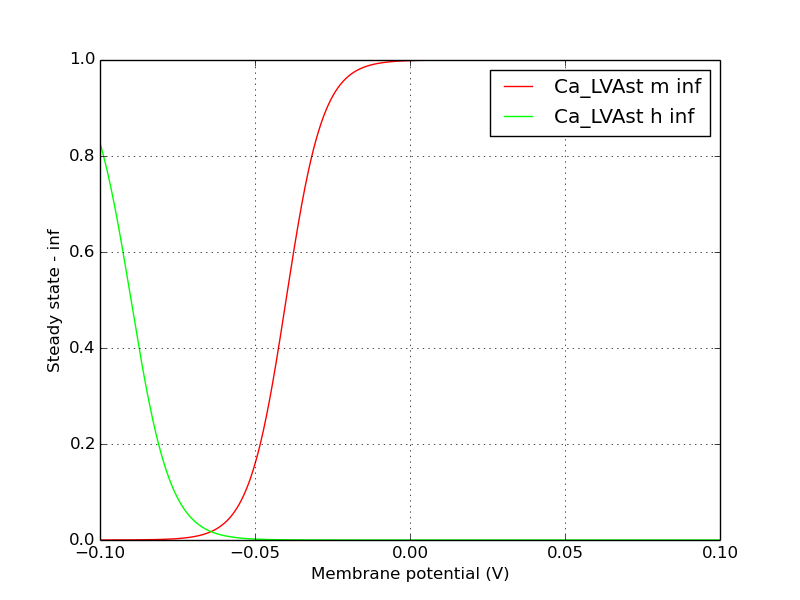</a>
</td>
<td>
<a href="Ca_LVAst.tau.png">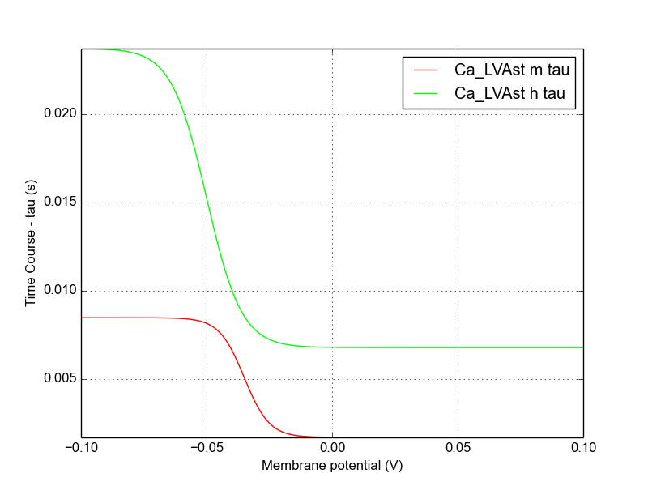</a>
</td>
</tr>
    <tr>
<td width="120px">
            <b>Ca_HVA</b> 
            <a href="../Ca_HVA.channel.nml">Ca_HVA.channel.nml</a> 
            <b>Ion: ca</b> 
            <i>g = gmax * m2 * h </i> 
            High voltage activated Ca2+ current. 
            
Comment from original mod file: 
Reuveni, Friedman, Amitai, and Gutnick, J.Neurosci. 1993
</td>
<td>
<a href="Ca_HVA.inf.png">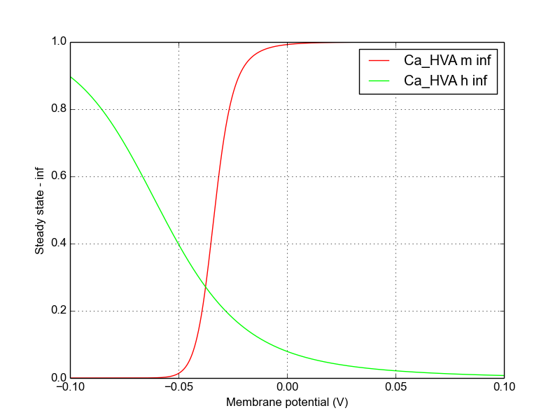</a>
</td>
<td>
<a href="Ca_HVA.tau.png">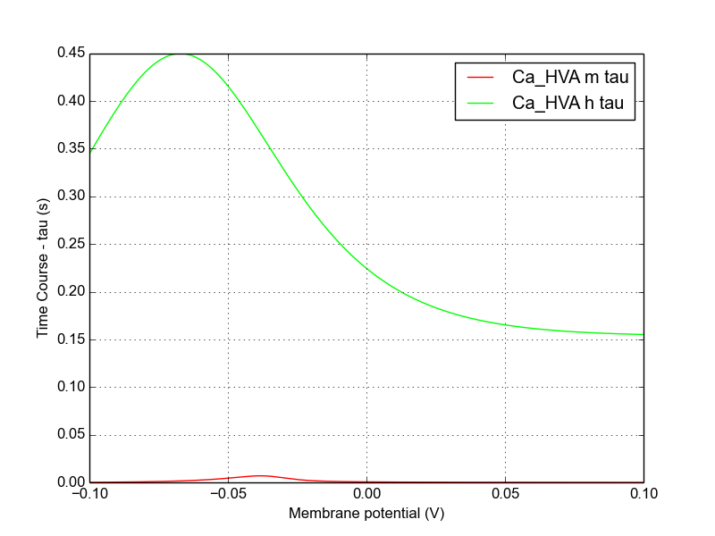</a>
</td>
</tr>
    <tr>
<td width="120px">
            <b>Ih</b> 
            <a href="../Ih.channel.nml">Ih.channel.nml</a> 
            <b>Ion: hcn</b> 
            <i>g = gmax * m </i> 
            Non-specific cation current
            
Comment from original mod file: 
Reference : :		Kole,Hallermann,and Stuart, J. Neurosci. 2006
</td>
<td>
<a href="Ih.inf.png">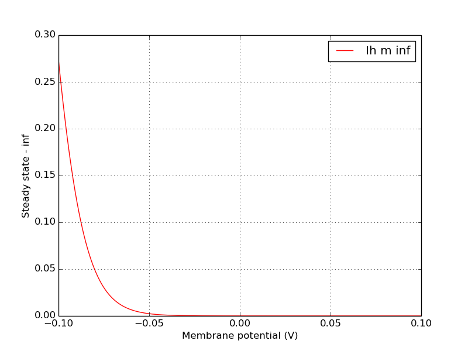</a>
</td>
<td>
<a href="Ih.tau.png">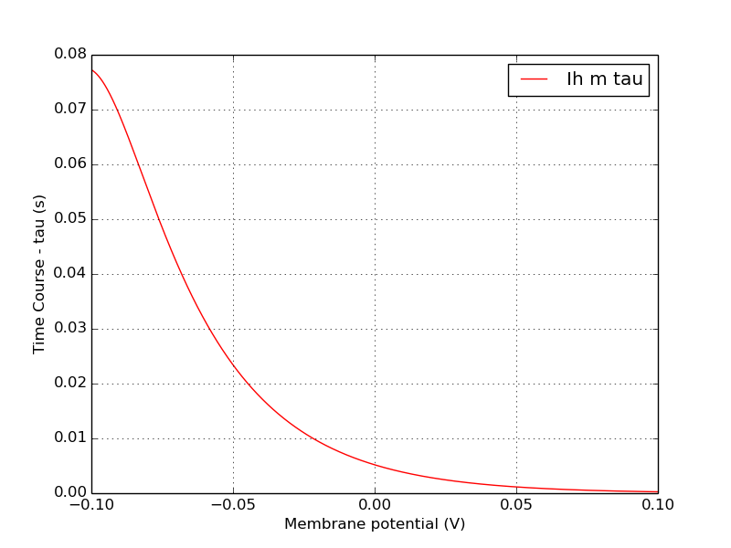</a>
</td>
</tr>
    <tr>
<td width="120px">
            <b>KdShu2007</b> 
            <a href="../KdShu2007.channel.nml">KdShu2007.channel.nml</a> 
            <b>Ion: kdshu</b> 
            <i>g = gmax * m * h </i> 
            K-D current for prefrontal cortical neuron - Yuguo Yu 2007
</td>
<td>
<a href="KdShu2007.inf.png">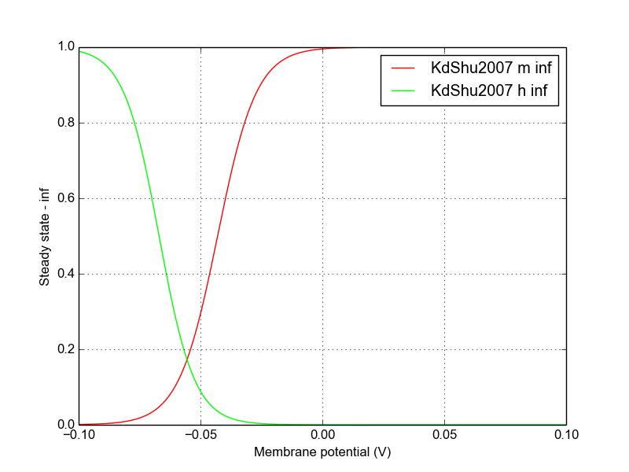</a>
</td>
<td>
<a href="KdShu2007.tau.png">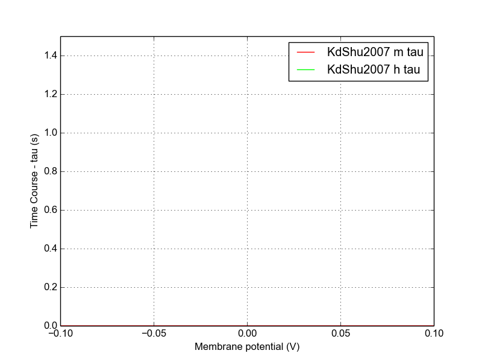</a>
</td>
</tr>
</table>

